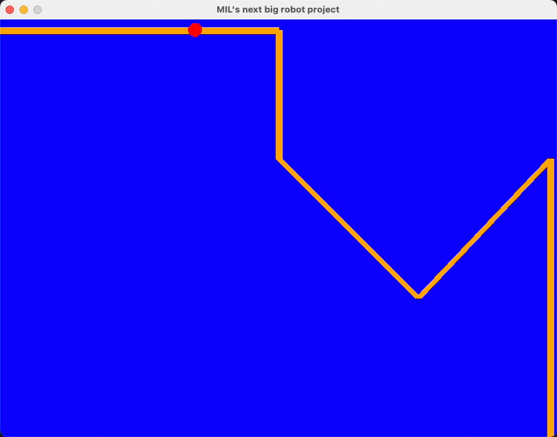

# Fall 2024 Application for the Software Team of the Machine Intelligence Laboratory

_(due Sunday, August 25th, 2024 at 11:59PM EST)_



Hello! Thanks for checking our lab, we appreciate your interest in
applying to work with us. To gauge the skills of our software members,
we ask all incoming applicants to complete a short coding challenge to
assess their skills at programming. This helps us ensure that all our
members have a baseline requisite of experience.

In this challenge, you will be asked to create a simple simulation of a
robot moving through a course, using a system similar to the [Robot
Operating System (ROS)](https://en.wikipedia.org/wiki/Robot_Operating_System), 
which we use in our lab. 

## Background

One important part of a robot is communication between its different software
components. One component might be responsible for moving the robot, another
for processing sensor data, and another for making decisions based on that
data. In ROS, these components communicate with each other by publishing and
subscribing to topics. A topic is a channel of communication that allows
different components to send and receive messages.

In this challenge, you will be asked to create a simple simulation of a robot
moving through a course. The robot will have a camera that can detect the
color of the course, and it will use this information to navigate through the
course. The robot will publish its position to a topic, and other components
will subscribe to this topic to get the robot's position.

## Setup Requirements
Before you start working on this project, make sure you have the following:

- Python 3.7 or higher
- `git`

## Getting Started
1. Clone this repository:
```
git clone https://github.com/uf-mil/fall-24-app.git
cd fall-24-app
```
2. Create a new repository (name can be whatever you'd like), but please make
sure that the repository is **private**!
3. (optional) Create and activate a Python virtual environment
4. Install the required packages into your project (listed below). You are free to install any other packages to aid you with your project.
```
pip install pygame numpy
```
5. Run the tests:
```
python3 -m unittest
```

## Implementation
You will be developing your implementation in two files: ```pubsub.py``` and ```path_following.py```. 

### Publishing and subscribing (`pubsub.py`)
The skeletons for three classes are given for you; you need to fill them out.
A brief description of the goals of each class is given below.

- **Topic:** A topic should be initialized with a string (the name of the topic). In addition, it should hold an array of subscriber objects whose callback function is called every time data is published to the topic.
- **Subscriber:** A subscriber should be initialized by passing in a topic and a callback function. A subscriber listens for new data published to a topic that triggers its callback function.
- **Publisher:** A publisher should be initialized with a topic. The purpose of a publisher is to push new data into a topic to trigger all the callback functions from the subscribers stored in the topic.

These terms are derived from ROS, so feel free to explore documentation or diagrams
about publishing/subscribing in ROS for more context.

### Path Following (`path_following.py`)
For your simulation, we will provide you with the pygame loop to test out your 
code. Your assignment will require you to fill in the ```PathFollowing.main``` function
with the expected mechanisms:

* Your class is given the topic to send position updates to, along with the topic
  where camera data is being published. The camera data given to you is a 20x20 square
  around the robot. Furthermore, you should apply the given
  delay between each movement. If `delay` is 1, then you should wait one second
  in between each movement.
* You can move as many spaces as you'd like at once, but you must move in a straight
  line. You can only move in the four cardinal directions (up, down, left, right).
* You should stop moving when you reach the end of the course, and your `main` function
  should return.
* You should publish your position to the topic given to you in the constructor.

_You may create any necessary helper files, classes, and methods if necessary._

### Evaluation

We will provide you with one sample course to test your code, but upon submission 
your code will be tested against a number of hidden test cases to evaluate the 
robustness of your path following algorithm (in addition to the aforementioned 
conditions for each file). Furthermore, we have provided an additional test to test
the functionality of topics.

Also, please don't worry if you are unable to complete the entire project/pass the test
cases. We are primarily focused on your thought process and your approach to the problem!

## Submission

When you are ready to submit your project, follow these steps:
1. Push your changes to your new repository:
```
git remote set-url origin https://github.com/<username>/<repo_name>.git
git push -u origin main
```
2. Invite the following users to your GitHub repository:
- `cbrxyz` (Cameron)
- `DaniParr` (Daniel)
3. Fill out the application form with the link to your repository. Congrats, you're done!


## Additional Notes

- You are free to use any resources you'd like to complete this project, but please
  do not copy code from other sources. We want to see your own work!
- You are welcome to use AI tools, but they are not necessary to complete this project.
  This should go without saying, but please do not use AI tools to write the entire
  solution for you.
- If you have any questions, please reach out to us via Discord or email (`cbrown14 at ufl dot edu`
  or `dparra1 at ufl dot edu`).

Good luck from all of us!

~ _Andrew, Cameron, Daniel, Keith, and the rest of the Machine Intelligence Laboratory_
